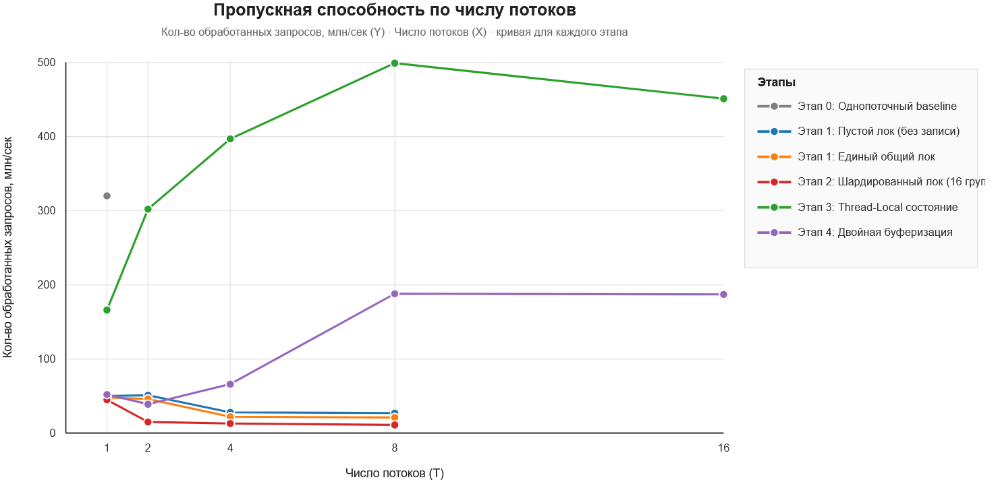

### Этап 5. Результаты и выводы (заполнить здесь)

Вместо отдельного отчёта просто внесите свои результаты прямо в таблицы ниже.

#### 1. Характеристики тестового стенда
- **Процессор (CPU):** 11th Gen Intel(R) Core(TM) i7-1165G7 @ 2.80GHz, 2803 МГц, ядер: 4, логических процессоров: 8
- **Число логических процессоров (`nproc`):** 8
- **Язык и версия:** Java 21 (OpenJDK)

#### 2. Замеры пропускной способности (млн оп/сек)
*Заполните медианные значения замерялки (в миллионах вызовов `record()` в секунду):*

| Число потоков (T)                                     | 1 поток | 2 потока | 4 потока | 8 потоков | 16 потоков |
| :---------------------------------------------------- | :-----: | :------: | :------: | :-------: | :--------: |
| **Этап 0:** Однопоточный baseline                     |   320   |    —     |    —     |     —     |     —      |
| **Этап 1:** Пустой лок (без записи)                   |   50    |    51    |    28    |    27     |     —      |
| **Этап 1:** Единый общий лок                          |   48    |    46    |    22    |    21     |     —      |
| **Этап 2:** Шардированный лок (16 групп)              |   45    |    15    |    13    |    11     |     —      |
| **Этап 3:** Thread-Local состояние (локальные данные) |   166   |   302    |   398    |    499    |    451     |
| **Этап 4:** Двойная буферизация                       |   52    |    39    |    66    |    188    |    187     |

*Приложите сюда ссылку или файл со сводным графиком всех реализаций (млн оп/сек от числа потоков):*  

#### 3. Результаты стресс-теста согласованности снимков
*10 000 вызовов `snapshot()` на фоне 4 пишущих потоков:*

| Реализация                                            | Доля битых снимков (sum != count) | Снимок: sum < count | Снимок: sum > count | Итоговый count − число вызовов (после join) |
| :---------------------------------------------------- | :-------------------------------: | :-----------------: | :-----------------: | :-----------------------------------------: |
| **Этап 2:** Шардированный лок                         |              0.9291               |       0.9256        |       0.0035        |                  1_861_116                  |
| **Этап 3:** Thread-Local состояние (локальные данные) |              0.9924               |       0.9924        |          0          |                 14_594_004                  |
| **Этап 4:** Двойная буферизация                       |                 0                 |          0          |          0          |                 12_110_955                  |
| **Этап 4 (без шага 3):** без проверки `active`        |              0.9986               |          0          |       0.9986        |                 36_119_027                  |

#### 4. Короткие ответы на вопросы (1–2 предложения прямо в таблице)

| Вопрос                                                                                                                                                                                                                                  | Ваш ответ                                                                                                                                                                                                               |
| :-------------------------------------------------------------------------------------------------------------------------------------------------------------------------------------------------------------------------------------- | :---------------------------------------------------------------------------------------------------------------------------------------------------------------------------------------------------------------------- |
| **1. Пустой лок против полного:** Почему пустой лок тоже резко падает с ростом потоков? Что добавляет полная версия?                                                                                                                    | Потоки упираются в ожидание одного лока. Из-за долгого ожидания могут уходить из контекста процесса, потом снова туда хагружаться -- большие накладные расходы Несколько малозатратных операций в критической секции |
| **2. Провал шардирования и атомиков:** Почему 16 шардов и атомарная сводка на этапе 2 не спасли скорость записи на законе Ципфа? Куда переехало узкое место?                                                                            | Появились горячие шарды бОльшая часть запросов попадает в одни и те же шарды, из-за чего потоки продолжают вставать в очередь на локи к этим шардам                                                                  |
| **3. Замедление на этапе 3:** Почему на этапе 3 рост скорости замедляется после 8 потоков? Как это связано с выводом `lscpu`?                                                                                                           | Число потоков становится больше числа процессоров, способных их обрабатывать -- больше расходов на управление ими, при этом эффективной работы больше не выполняется                                                    |
| **4. Двойная буферизация против TLS:** Почему этап 4 медленнее этапа 3 (в C++ в 2,5–3,5 раза, в Java в 1,1–1,7 раза, а на 16 потоках Java почти догоняет этап 3), но масштабируется почти линейно? В чём разница инструкций при записи? |                                                                                                                                                                                                                         |
| **5. Эксперимент с шагом 3:** Что сломалось в тесте на этапе 4, когда вы убрали повторную проверку `active == b`? Почему итоговый `count` расходится с числом вызовов?                                                                  |                                                                                                                                                                                                                         |
